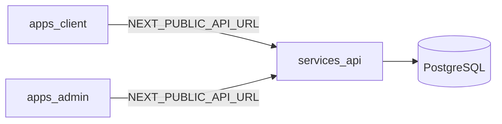

# FlavorOS

Multi-tenant executive assistant platform — MVP vertical slice (Next.js client/admin + FastAPI + PostgreSQL).

- **Docs:** see [`docs/README.md`](docs/README.md) for product and architecture intent.
- **Repo layout:** [`docs/architecture/repo_structure.md`](docs/architecture/repo_structure.md).

## Stack (this slice)

| Area | Path | Notes |
|------|------|--------|
| Client shell | [`apps/client`](apps/client) | MVP surfaces / navigation placeholders |
| Admin shell | [`apps/admin`](apps/admin) | Diagnostics placeholders (port **3001**) |
| API | [`services/api`](services/api) | FastAPI: `/health`, JWT `/auth/*`, tenant-scoped `/profiles/*` |
| Postgres | Docker Compose | Local database |



## Prerequisites

- **Node:** 20+ with [Corepack](https://nodejs.org/api/corepack.html) enabled (`corepack enable`).
- **pnpm:** `corepack prepare pnpm@9.15.4 --activate`
- **Python:** 3.9+
- **Docker:** for Postgres

## Quick start

### 1. Environment

Copy the example env file at the repo root (API reads `DATABASE_URL`, JWT, etc. via `services/api` settings):

```bash
cp .env.example .env
```

Edit `.env` if needed. The API defaults match [`docker-compose.yml`](docker-compose.yml).

The API uses **SQLAlchemy + psycopg (v3)**. If you use a bare `postgresql://` or `postgres://` URL, settings normalize it to `postgresql+psycopg://` automatically so you do not need a separate `psycopg2` driver.

Next.js does **not** load the repo-root `.env` when you run apps from subfolders. Create per-app local env files:

```bash
printf '%s\n' \
  'NEXT_PUBLIC_API_URL=http://localhost:8000' \
  'NEXT_PUBLIC_DEFAULT_TENANT_SLUG=demo' \
  > apps/client/.env.local

printf '%s\n' \
  'NEXT_PUBLIC_API_URL=http://localhost:8000' \
  'NEXT_PUBLIC_DEFAULT_TENANT_SLUG=demo' \
  > apps/admin/.env.local
```

### 2. Database

```bash
docker compose up -d postgres
```

Ensure **Docker Desktop** (or your container runtime) is running; otherwise this step fails with “Cannot connect to the Docker daemon”.

Wait until healthy (`docker compose ps`).

### 3. API

```bash
cd services/api
python -m venv .venv && source .venv/bin/activate   # Windows: .venv\Scripts\activate
pip install -e ".[dev]"
alembic upgrade head
uvicorn app.main:app --reload --host 0.0.0.0 --port 8000
```

- OpenAPI / Swagger: http://localhost:8000/docs  
- Health: http://localhost:8000/health  

Dev seed creates **`demo`** and **`acme`** tenants plus demo users (see [`services/api/README.md`](services/api/README.md)).

### 4. Frontends

From repo root:

```bash
pnpm install
pnpm dev:client    # http://localhost:3000
pnpm dev:admin     # http://localhost:3001
```

The client **Command Center** home polls **`GET /health`** using `NEXT_PUBLIC_API_URL`.

## MVP scope vs roadmap

**In this repo slice:** repository skeleton aligned with docs, `pnpm` workspaces, FastAPI with `X-Client-ID` tenant resolution, JWT login with `client` / `developer_admin` roles, `tenants` / `users` / `profiles` tables, Alembic migrations, Dockerized Postgres, Next.js shells with MVP route maps.

**Explicitly deferred:** Composio OAuth, in-repo GBrain subsystem, orchestrator, briefing/meeting engines, voice, mobile shell — see [`docs/planning/mvp_build_notes.md`](docs/planning/mvp_build_notes.md).

## Canonical Planning Policy

This repository is the canonical home for FlavorOS functionality, architecture, workflows, and planned feature coverage.

- Features should be represented in this repo even when they are future-state or deferred beyond MVP.
- Deferred features may remain documented-only, but they should not survive only in an external planning workspace.
- The external Dropbox `.planning` workspace is reference material, not canonical product truth.
- Current implementation priorities should follow the MVP plan at [FLAVOROS_MVP_PROJECT_PLAN.md](</Users/marcusbivines/Library/CloudStorage/Dropbox/My Mac (Marcuss-MacBook-Pro.local)/Documents/FlavorOS/planning/00-flavoros-mvp-delivery-system/FLAVOROS_MVP_PROJECT_PLAN.md>).
- For migration status of planned features, see [`docs/planning/feature_migration_inventory.md`](docs/planning/feature_migration_inventory.md).

## Smoke checks

1. `curl -s http://localhost:8000/health` returns JSON with an `ok` or status field (see implementation).
2. Load http://localhost:3000 and http://localhost:3001 — no runtime errors; API status panel shows **ok** when the API is up.
3. `POST http://localhost:8000/auth/login` with tenant `demo` and seeded credentials returns a Bearer token (use Swagger).

## Troubleshooting

### `Application startup failed` or `role "flavoros" does not exist`

Startup runs a **dev seed** against Postgres. If something is listening on `5432` but it is **not** the Compose database (for example Homebrew Postgres), credentials won’t match and seeding used to abort the whole process.

**Fix:** run `docker compose up -d postgres`, wait until healthy, then `alembic upgrade head` — or set `DATABASE_URL` in `.env` to a user/database that exists on **your** server.

The API **still boots** when the DB is unreachable: you’ll see a warning in the logs; **`GET /health`** works. **`API_SKIP_STARTUP_SEED=true`** skips the seed attempt entirely (optional).

## Monorepo scripts

| Script | Description |
|--------|-------------|
| `pnpm dev:client` | Next.js client on port 3000 |
| `pnpm dev:admin` | Next.js admin on port 3001 |
| `pnpm build` | Build all workspace packages |
| `pnpm lint` | ESLint across apps |
