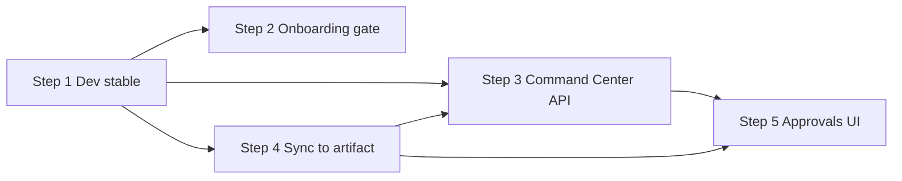

# Build Vertical Slice Tasks (Steps 1–5)

## Status

File-level implementation checklist for the **demo vertical slice** defined in [`build_roadmap_assessment.md`](./build_roadmap_assessment.md). Scope is **steps 1–5 only** (step 6+ operator console is out of scope here).

**Progress as of 2026-05-19:** Steps 1–5 complete. Demo vertical slice done.

**Next session:** [next_session_handoff.md](./next_session_handoff.md) — post-slice lanes, ready work, constraints.

| Step | Status |
|---|---|
| 1 — Stabilize local dev | ✅ Done |
| 2 — Onboarding gate | ✅ Done |
| 3 — Wire Command Center to API | ✅ Done |
| 4 — Close sync → artifact loop | ✅ Done |
| 5 — Approvals in the UI | ✅ Done |

**Implementation notes (deviations from plan):**
- API runs on `127.0.0.1:8001` (not `localhost:8000`) — Docker Desktop occupies port 8000 via IPv6; `localhost` on macOS resolves to `::1` which hits Docker, so `127.0.0.1` is used explicitly throughout `.env.local` and seed/config references.
- Postgres runs on local system install (not Docker) — Docker Desktop also claims `5432`. Local role `flavoros` / DB `flavoros` created directly.
- Pydantic `EmailStr` changed to `str` in `schemas.py` (`LoginRequest`, `UserPublic`) — `email-validator` rejects `.local` TLD addresses used in dev seed data.
- Step 4 processor is inline (synchronous, called after sync commit) rather than a background worker — acceptable for demo; resilience and async dispatch are post-slice concerns.

| Canon | Role |
|---|---|
| [`current_build_plan.md`](./current_build_plan.md) | Phases, proof loop, non-negotiables |
| [`build_roadmap_assessment.md`](./build_roadmap_assessment.md) | Why and in what order |
| **This file** | What to change, file by file |

### Demo slice definition

One tenant can: **log in → finish onboarding (one Google provider + first sync) → see real artifact + approval on Command Center → decide from the UI with audit.**

---

## Cross-cutting notes

### Environment variable naming

| Location | Variable | Notes |
|---|---|---|
| `apps/flavoros/src/lib/api.ts` | `NEXT_PUBLIC_FLAVOROS_API_URL` | **Authoritative** for the Next app (fallback `http://localhost:8000`) |
| `apps/flavoros/README.md` | `NEXT_PUBLIC_FLAVOROS_API_URL` | Matches `api.ts` |
| Root `.env.example` | `NEXT_PUBLIC_API_URL` | **Mismatch** — align root example or document copy-into `apps/flavoros/.env.local` |
| `apps/flavoros/.env.example` | `NEXT_PUBLIC_INSTANT_APP_ID` only | Add `NEXT_PUBLIC_FLAVOROS_API_URL` when stabilizing step 1 |

### Fixture → API type mapping (step 3)

UI types today live in `apps/flavoros/src/lib/fixtures.ts`:

- `InboxItem.pile`: `urgent` \| `needs-attention` \| `updates`
- `InboxItem.kind`: `approval` \| `update` \| `event`

API types (`services/api/app/schemas.py`):

- `ArtifactRead`: `kind`, `title`, `body`, `meta`, `status`, `workflow_run_id`, …
- `ApprovalRead`: `artifact_id`, `governed_action`, `reason`, `decision` (`pending` \| `approved` \| `rejected` \| `expired`)

**New mapper module** should own pile/kind assignment (e.g. pending approval → `urgent` + `kind: approval`; sigma/summary artifacts → `updates`).

### Auth session

- Session: `apps/flavoros/src/lib/api.ts` (`loadSession`, `saveSession`, Bearer + `X-Client-ID`)
- No route guard on `(client)/layout.tsx` today — add in step 2 if login gate is insufficient

---

## Step 1 — Stabilize local dev (~0.5 day)

**Goal:** Repeatable `login → onboarding → API` on one machine.

**Acceptance**

- [x] `docker compose up -d` brings Postgres on `5432` *(local Postgres used — see implementation notes)*
- [x] `alembic upgrade head` succeeds; API serves `http://localhost:8000` *(API on `127.0.0.1:8001` — see notes)*
- [x] `pnpm dev` serves Next app with API URL pointing at local API
- [x] `POST /auth/login` with `demo` / `client@demo.local` / `devclient` returns token *(fixed `EmailStr → str`)*
- [x] Onboarding save + provider sync return 2xx (no CORS/auth surprises)

### Touch points

| Action | Path |
|---|---|
| **Read / verify** | `docker-compose.yml` |
| **Read / verify** | `services/api/README.md` |
| **Read / verify** | `services/api/pyproject.toml` or `requirements.txt` (venv install) |
| **Run** | `services/api/alembic/` migrations |
| **Read / verify** | `services/api/app/main.py` (CORS, router mounts) |
| **Read / verify** | `services/api/app/seed.py` (tenant `demo`, user `client@demo.local`) |
| **Optional env** | Root `.env` from `.env.example` (`DATABASE_URL`, `DEV_CLIENT_PASSWORD`) |
| **Modify** | `apps/flavoros/.env.example` — add `NEXT_PUBLIC_FLAVOROS_API_URL=http://localhost:8000` |
| **Local only** | `apps/flavoros/.env.local` (gitignored) — same URL + optional `NEXT_PUBLIC_INSTANT_APP_ID` |
| **Read / verify** | Root `package.json` — `pnpm dev` filters `flavoros` |
| **Smoke** | `apps/flavoros/src/app/login/page.tsx`, `onboarding/page.tsx` — manual E2E |

### Tests (optional for step 1)

| Action | Path |
|---|---|
| **Run existing** | `services/api/tests/test_health.py` |

---

## Step 2 — Onboarding gate (1–2 days)

**Goal:** Onboarding is entry governance, not the permanent home after login.

**Acceptance**

- [x] After login, **ready** clients land on `/command-center`
- [x] **Not ready** clients land on `/onboarding`
- [x] Readiness rule matches onboarding UI (`canFinish`: intake saved + all OAuth accounts `ready`) or persisted `onboarding_status === active`
- [x] Direct navigation to `/command-center` without session redirects to `/login`
- [x] Optional: `/onboarding` redirects to Command Center when already ready

### Readiness signal (pick one, document in code)

| Option | Where | Notes |
|---|---|---|
| **A — Client-side** | Reuse onboarding logic | `GET` provider list + compare to eligible OAuth accounts (no new API) |
| **B — Profile preference** | `Profile.preferences.onboarding_complete` | Set on “Finish onboarding”; check in `GET /profiles/me` |
| **C — Universe entry** | `ClientUniverseEntry` `category=onboarding`, `key=status` | Values per `schemas.py`: `pending` … `active` |

### Touch points

| Action | Path |
|---|---|
| **Modify** | `apps/flavoros/src/app/login/page.tsx` — replace unconditional `router.push("/onboarding")` with readiness branch |
| **Create** | `apps/flavoros/src/lib/onboarding-gate.ts` — `isClientReadyForCommandCenter(session): Promise<boolean>` (providers + optional profile) |
| **Modify** | `apps/flavoros/src/lib/api.ts` — add `listProviderConnections(session)` or thin wrapper around `GET /providers` if route exists; else use onboarding save response pattern |
| **Read** | `services/api/app/routers/providers.py` — list connections endpoint (add `GET /providers` if missing) |
| **Read** | `services/api/app/schemas.py` — `OnboardingSaveRequest.onboarding.status`, `ProviderConnectionRead.status` |
| **Modify (optional)** | `apps/flavoros/src/app/onboarding/page.tsx` — on mount, redirect to `/command-center` if already ready |
| **Modify (optional)** | `apps/flavoros/src/app/(client)/layout.tsx` or `components/AppShell.tsx` — session guard + redirect |
| **Modify (optional, B)** | `services/api/app/routers/onboarding.py` — set `onboarding.status: active` on finish path |
| **Modify (optional, B)** | `apps/flavoros/src/app/onboarding/page.tsx` — `PATCH /profiles/me` or dedicated finish endpoint when user clicks “Finish onboarding” |

### Tests

| Action | Path |
|---|---|
| **Add** | `services/api/tests/test_onboarding_gate.py` — provider status → ready/not ready (if server-side signal added) |

---

## Step 3 — Wire Command Center to API (3–5 days)

**Goal:** Command Center is the first client surface on durable data.

**Acceptance**

- [x] Greeting uses `GET /profiles/me` (`display_name`, `timezone`)
- [x] Inbox piles populated from `GET /artifacts` (mapped to `InboxItem[]`)
- [x] “Ready to approve” strip from `GET /approvals?decision=pending` (or client filter)
- [x] `LeftNav` shows API profile, not `clientProfile` fixture
- [x] Empty API responses show intentional empty states (fixtures optional as **fallback only** for dev demos — prefer explicit empty copy)
- [x] Loading and error states on Command Center (session missing → redirect handled in step 2)

### Touch points

| Action | Path |
|---|---|
| **Modify** | `apps/flavoros/src/lib/api.ts` — types: `ProfileRead`, `ArtifactRead`, `ApprovalRead`; helpers `getProfile`, `listArtifacts`, `listApprovals` |
| **Create** | `apps/flavoros/src/lib/mappers.ts` — `artifactToInboxItem`, `approvalToInboxItem`, pile heuristics |
| **Create (optional)** | `apps/flavoros/src/lib/hooks/useCommandCenterData.ts` — client hook: parallel fetch profile + artifacts + approvals |
| **Modify** | `apps/flavoros/src/app/(client)/command-center/page.tsx` — convert to client component (`"use client"`) or split `CommandCenterClient.tsx`; remove fixture imports for hero data |
| **Modify** | `apps/flavoros/src/components/ClientInbox.tsx` — accept props only (likely no change if already prop-driven) |
| **Modify** | `apps/flavoros/src/components/LeftNav.tsx` — accept `displayName` / profile props from layout or fetch |
| **Modify** | `apps/flavoros/src/app/(client)/layout.tsx` — fetch profile once, pass to `LeftNav` + children context (optional `ProfileProvider`) |
| **Read only (defer)** | `apps/flavoros/src/components/GoalsStrip.tsx`, `MiniCalendar.tsx` — keep fixtures until post-slice |
| **Read** | `services/api/app/routers/artifacts.py` — query params, pagination |
| **Read** | `services/api/app/routers/approvals.py` — list filters |
| **Read** | `services/api/app/routers/profiles.py` — `GET /me`, `PATCH /me` |
| **Trim usage** | `apps/flavoros/src/lib/fixtures.ts` — stop importing `inboxItems`, `todayOperatingPicture`, `clientProfile` from Command Center / LeftNav paths |

### API contract reminders

```http
GET /profiles/me
GET /artifacts
GET /approvals
```

Headers: `Authorization: Bearer <token>`, `X-Client-ID: <tenant slug>` (see `api.ts`).

### Tests

| Action | Path |
|---|---|
| **Add** | `apps/flavoros` — optional component test for mapper (if test harness exists); otherwise manual QA checklist in PR |
| **Run existing** | `services/api/tests/test_tenant_isolation.py` — ensure list endpoints respect tenant |

---

## Step 4 — Close sync → artifact loop (3–5 days, backend)

**Goal:** First provider sync produces inbox-visible `Artifact` and `Approval` rows.

**Acceptance**

- [x] After `POST /providers/{provider}/sync`, client can `GET /artifacts` and see ≥1 row tied to `workflow_run_id`
- [x] When workflow requires sign-off, `GET /approvals` returns ≥1 `pending` approval linked to that artifact
- [x] `WorkflowRun` moves from `queued` → `completed` (stub orchestrator acceptable)
- [x] `AgentTask` rows reach terminal status consistent with run
- [x] Idempotent or safe on re-sync (no duplicate approvals for same run — define rule in processor)

### Current gap

`services/api/app/routers/providers.py` — `sync_provider` queues `provider_first_sync` / `provider_first_sync_review` but does **not** create `Artifact` / `Approval`. Pattern reference: `services/api/app/onboarding.py` — `_create_onboarding_sigma`, `_queue_workflow`.

### Touch points

| Action | Path |
|---|---|
| **Modify** | `services/api/app/routers/providers.py` — after commit of sync + workflow queue, invoke processor (inline or background) |
| **Create** | `services/api/app/workflows/provider_first_sync.py` — `process_provider_first_sync(db, workflow_run_id)` creates artifact body + optional approval |
| **Modify** | `services/api/app/adapters/orchestrator.py` — `StubOrchestratorAdapter.launch` should update `WorkflowRun.status` / `completed_at` in DB when called from processor (today returns completed without persisting) |
| **Read** | `services/api/app/models.py` — `WorkflowRun`, `AgentTask`, `Artifact`, `Approval`, `NormalizedItem` |
| **Read** | `services/api/app/onboarding.py` — `_create_onboarding_sigma`, `_queue_workflow`, `_queue_agent_task` |
| **Modify (optional)** | `services/api/app/routers/workflows.py` — `POST /workflows/{id}/process` for manual/dev replay |
| **Read** | `services/api/app/routers/artifacts.py`, `approvals.py` — ensure created rows are listable with default filters |

### Suggested artifact / approval payload (demo)

| Entity | Suggested values |
|---|---|
| **Artifact** | `kind`: `sigma` or `report`; `title`: “First inbox sweep”; `body`: summary text; `meta.provider`, `meta.normalized_item_ids`; `workflow_run_id` set |
| **Approval** | `governed_action`: `provider_first_sync_review`; `reason`: human-readable; `decision`: `pending`; `artifact_id` → artifact above |

### Tests

| Action | Path |
|---|---|
| **Add** | `services/api/tests/test_provider_first_sync.py` — sync → process → assert artifact + approval exist |
| **Modify** | `services/api/tests/conftest.py` — fixtures for tenant, user, provider connection if needed |
| **Run** | `services/api/tests/test_onboarding_composio.py` — regression after shared workflow helpers change |

---

## Step 5 — Approvals in the UI (2–3 days)

**Goal:** Client can approve or reject prepared work; audit trail records the decision.

**Acceptance**

- [x] Command Center shows pending approvals (from step 3) with actionable UI
- [x] Approve / reject calls `POST /approvals/{id}/decide` with body per schema
- [x] UI updates after decision (refetch or optimistic remove from strip)
- [x] `AuditEvent` row created on decide (gap today)
- [x] Rejected / approved items no longer appear in pending strip

### Touch points

| Action | Path |
|---|---|
| **Modify** | `apps/flavoros/src/lib/api.ts` — `decideApproval(session, approvalId, decision, reason?)` |
| **Modify** | `apps/flavoros/src/components/ApprovalCard.tsx` — wire `onApprove` / `onReject` to API; loading + error per card |
| **Modify** | `apps/flavoros/src/app/(client)/command-center/page.tsx` — pass real approvals into strip; handle decide callbacks |
| **Read** | `services/api/app/routers/approvals.py` — `decide_approval` handler |
| **Modify** | `services/api/app/routers/approvals.py` — after decision commit, insert `AuditEvent` (mirror patterns in `providers.py` / `onboarding.py`) |
| **Read** | `services/api/app/models.py` — `AuditEvent` fields |
| **Defer (post-slice)** | `apps/flavoros/src/app/(client)/briefings/[type]/page.tsx`, `meetings/[topic]/page.tsx` — still fixture-driven `ApprovalCard` |

### Decide request shape

Confirm against `ApprovalDecide` (or equivalent) in `services/api/app/schemas.py` before implementing client body.

### Tests

| Action | Path |
|---|---|
| **Add** | `services/api/tests/test_approvals_decide.py` — decide → approval status + audit event |
| **Manual** | Command Center: approve one pending item; verify `GET /audit` or DB row |

---

## Dependency graph (steps 1–5)



**Parallelization:** Step 4 (backend) can start as soon as step 1 is green. Step 3 can ship empty states before step 4 lands. Step 5 depends on step 3 list UI and step 4 creating pending approvals.

---

## Post-slice work (completed outside steps 1–5)

Tracked in [parallel_lanes_tracker.md](./parallel_lanes_tracker.md). Summary:

| Lane | Status | Shipped |
|---|---|---|
| A — Backend step 4 | ✅ Done | Inline `provider_first_sync` processor |
| B — API tests | ✅ Done | `test_provider_first_sync.py`, `test_approvals_decide.py` |
| C — Admin console | ✅ Done | `admin-api.ts`, `admin-surfaces.ts`, `AdminSurfacePanel`, live `/admin` |
| F — Settings | ✅ Done | `useSettingsData`, settings page wired |
| G — Docs | ✅ Done | `local_dev_runbook.md`, tracker |

**Still open:** D (smoke), I (channels), E (CI), H (GBrain), J (write-back, blocked).

---

## Out of scope for steps 1–5 (deferrals)

These were intentionally excluded from the slice checklist. Status as of 2026-05-19:

| Item | Slice scope | Current status |
|---|---|---|
| `apps/flavoros/src/app/admin/*` API wiring | Out of slice | ✅ Done (Lane C) |
| Channel pages off fixtures | Out of slice | ⏳ Lane I |
| InstantDB realtime | Out of slice | Not started |
| Full Composio production OAuth | Out of slice | Not started |
| GBrain ingestion, voice, write-back | Out of slice | H / J not started |

---


## Verification checklist (end-to-end)

Run after steps 1–5:

1. `demo` / `client@demo.local` / `devclient` login → Command Center (if already onboarded) or onboarding
2. Complete onboarding through **Verify first sync** on one OAuth provider
3. Command Center shows **non-empty** inbox from API
4. At least one **pending** approval visible
5. Approve or reject → item leaves pending strip; audit row exists
6. Hard refresh — state persists (Postgres, not fixtures)

---

## Related paths (quick reference)

| Area | Path |
|---|---|
| **Next session handoff** | `docs/planning/next_session_handoff.md` |
| Parallel lanes | `docs/planning/parallel_lanes_tracker.md` |
| Local dev runbook | `docs/planning/local_dev_runbook.md` |
| Assessment | `docs/planning/build_roadmap_assessment.md` |
| Dev plan | `docs/planning/current_build_plan.md` |
| Fixtures (remaining) | `apps/flavoros/src/lib/fixtures.ts` |
| API client | `apps/flavoros/src/lib/api.ts` |
| Admin API client | `apps/flavoros/src/lib/admin-api.ts` |
| Mappers | `apps/flavoros/src/lib/mappers.ts` |
| Command Center | `apps/flavoros/src/app/(client)/command-center/page.tsx` |
| Provider sync | `services/api/app/routers/providers.py` |
| Sync processor | `services/api/app/workflows/provider_first_sync.py` |
| Onboarding helpers | `services/api/app/onboarding.py` |
| Orchestrator stub | `services/api/app/adapters/orchestrator.py` |
