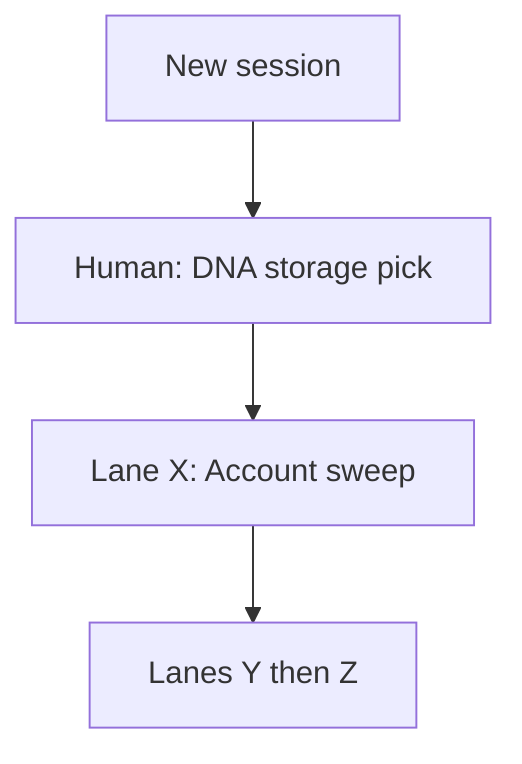

# Next Session Handoff

**Last updated:** 2026-05-23 (repo cleanup complete: services/ down to api-only, gbrain scripts → scripts/gbrain/, stub services → docs/architecture/planned_services.md, root stubs workflows/personas/runtime/ removed, CLAUDE.md layer map added, handoff zones added; next: human DNA storage pick, Lane X)  
**Purpose:** Single entry point for a new agent session. Read this first, then the linked docs.

---

## Session handoff close-out procedure

Before ending a session that changes project state:

1. Update timestamps on every planning doc you touched.
2. Update `parallel_lanes_tracker.md` lane state and append a timestamped session-log row.
3. Update `build_roadmap_assessment.md` if the bottleneck, recommended order, or proof status changed.
4. Update this handoff so the top of the file reflects only active or next-up work.
5. Search for references to the completed lane/task in planning docs and then:
   - remove stale “next step” references
   - move useful completion details into archive/completed sections
   - rewrite any leftover “owned by lane X” language into current, role-based guidance if needed
6. Re-read the opening sections of this file, `parallel_lanes_tracker.md`, and `build_roadmap_assessment.md` to confirm completed work has been downshifted or removed where appropriate.

Rule of thumb:

- if a completed item is still visible near the top of a planning doc, it should be there only because it explains the current state, not because it still reads like active work.

---

**Slice lock:** `complete` — post-slice work is allowed; avoid drive-by edits to slice-owned files unless tasked.

---

## Before you start (3 steps)

1. Read this file top-to-bottom.
2. Open [parallel_lanes_tracker.md](./parallel_lanes_tracker.md) and claim your lane (set status to `in_progress`).
3. Cross-check the **Coordinate zone** below against active lanes before touching any shared path.

---

## Repo zones

| Zone | Paths | Rule |
|---|---|---|
| **Free** — edit without coordination | `docs/**`, `skills/**`, `agents/**`, `integrations/**`, `configs/**`, `governance/**`, `client_universe/**` | Spec/authored artifacts only; no runtime merge conflicts |
| **Coordinate** — serialize with active lanes | `services/api/app/routers/providers.py`, `approvals.py`, `orchestrator.py`, `workflows/provider_first_sync.py`, `schemas.py`, `apps/flavoros/src/lib/api.ts`, `command-center/page.tsx`, `onboarding/page.tsx`, `ApprovalCard.tsx`, `SessionGuard.tsx` | Shared runtime — check parallel_lanes_tracker.md before touching |
| **Human-only** — do not edit in agent sessions | `.github/workflows/deploy-api.yml`, `CLAUDE.md` (structural changes), `alembic/versions/` (new migrations need explicit task) | Deployment config and migration files; human must review before merge |
| **Gbrain tooling** | `scripts/gbrain/` | Gbrain CI scripts; do not modify unless working on gbrain subsystem |
| **Legacy intake** | `_migration/` | Not wired to running system — do not implement against anything here |

---

## Doc map (read order)

| Order | File | Use when |
|---|---|---|
| 1 | **This file** | Picking up work in a new chat |
| 2 | [parallel_lanes_tracker.md](./parallel_lanes_tracker.md) | Claiming a lane; session log |
| 3 | [local_dev_runbook.md](./local_dev_runbook.md) | Running API + Next locally |
| 4 | [build_roadmap_assessment.md](./build_roadmap_assessment.md) | Why / sequencing / MVP gaps |
| 5 | [archive/build_vertical_slice_tasks.md](./archive/build_vertical_slice_tasks.md) | Archived slice history (steps 1–5) |
| 6 | [current_build_plan.md](./current_build_plan.md) | Canonical phases (conflicts win here) |

---

## Constraints for parallel agents

1. **Admin HTTP:** Use `apps/flavoros/src/lib/admin-api.ts` — do **not** add admin-only helpers to `api.ts`.
2. **High-collision shared backend:**  
   `providers.py`, `approvals.py`, `orchestrator.py`, `workflows/provider_first_sync.py`, `schemas.py` (email fields).
3. **High-collision shared client UI:**  
   `command-center/page.tsx`, `onboarding/page.tsx`, `login/page.tsx`, `ApprovalCard.tsx`, `SessionGuard.tsx`, `api.ts` core auth/session.
4. **Interpretation:** these are not “owned by completed lanes” anymore. They are listed because they are still shared-core files where parallel edits need extra care.

Before first commit: update your lane row in [parallel_lanes_tracker.md](./parallel_lanes_tracker.md) to `in_progress`, then `done` when finished.

---

## Ready work (pick one lane per session)

**Completed this session (2026-05-22):** Lane **V** (TODO-5/6), Lane **W** docs (TODO-7 partial — storage decision still human). **Working tree (uncommitted):** outbound scheduled send (`20260522_0008` migration + dispatch script + Communications UI).

**Merged on main (prior sessions):** R (`deploy-api.yml`), S (invite/registration), T (`client_onboarding` orchestration), U (Gmail send via Composio).

---

### Next up (human or agent)

| Priority | Lane / item | Notes |
|----------|-------------|--------|
| 1 | **Human** — DNA storage model | Pick relational `client_dna_*` vs GBrain-only vs hybrid — see [`client_dna_adoption_build_plan.md`](./client_dna_adoption_build_plan.md) open decision table |
| 2 | **X** — Account sweep MVP | Blocked on storage pick; then TODO-8 |
| 3 | **Ops** — VPS `alembic upgrade head` for `20260522_0008` + outbound cron | After merge/commit of outbound + invite `0008` if not on VPS yet |
| 4 | **Commit** — outbound scheduling + any API doc-only deltas | User did not request commit in autonomous session |

### Client DNA adoption track (lanes W–Z)

| Lane | Goal | Status |
|------|------|--------|
| **W** | DNA canon & storage design | **Done (docs)** — human must choose storage |
| **X** | Account sweep MVP | Ready after human storage pick |
| **Y** | Parse & synthesize (`client_dna_candidate`, SIGMA `client_dna`) | `skills/`, `adapters/gbrain.py`, `models.py`, `alembic/`, workflows | X |
| **Z** | HITL verify & adoption | `routers/`, `apps/flavoros/.../admin/**`, `admin-api.ts`, workflows | Y |

**Docs:** [`docs/workflows/client_dna_adoption_model.md`](../workflows/client_dna_adoption_model.md), [`client_dna_adoption_build_plan.md`](./client_dna_adoption_build_plan.md). **TODOS:** TODO-7 through TODO-10.

**Sequencing:** App onboarding completes first; historical sweeps launch explicitly afterward (Lane T remains orchestration-only for `client_onboarding` — see TODO-2b scope note in `TODOS.md`).

**Done (not a ready lane):** Lane **U** (real Gmail send) shipped 2026-05-22. Lane **R** (auto-deploy) shipped 2026-05-22 (`c608062`). Lane **S** (invite/registration) shipped 2026-05-22 (`d0bf663`) — run `alembic upgrade head` on VPS to apply migration 0008.

---

## Suggested pick-up plan (next 2–4 weeks)



| Week | Focus | Outcome |
|---|---|---|
| Done (2026-05-22) | R, S, T, U, V, W (docs) | Deploy, invite, onboarding orchestration, Gmail send, sync dedup + async |
| Next | Human storage decision | Unblocks Lane X migrations |
| Next | Lane X → Y → Z | Client DNA adoption implementation |
| Ops | Commit outbound scheduling + VPS alembic/cron | See working tree + migration `20260522_0008` |

---

## Verification commands

From repo root unless noted.

```bash
# API tests (use venv — system Python 3.9 may fail on typing)
cd services/api && .venv/bin/python -m pytest \
  tests/test_provider_first_sync.py \
  tests/test_approvals_decide.py \
  tests/test_outbound_actions.py \
  -q

# Next.js typecheck
cd apps/flavoros && pnpm exec tsc --noEmit

# API health + outbound smoke (API must be on 127.0.0.1:8008, migrated + seeded)
curl -sf http://127.0.0.1:8008/health
./scripts/smoke-vertical-slice.sh
```

**Local URLs:** Next `http://localhost:3000`, API `http://127.0.0.1:8008` (see runbook).  
**Production URLs:** App `https://flavoros.vercel.app`, API `https://api.flavoros.cc`

**Operational note:** `ANTHROPIC_API_KEY` must not be set as an empty string in the shell. pydantic-settings prioritizes shell env vars over `.env` — if `ANTHROPIC_API_KEY=` is exported (even empty), it shadows the real key in `services/api/.env`. Run `unset ANTHROPIC_API_KEY` before starting the API process if the key lives only in `.env`.

**Manual E2E:** login → onboarding (if needed) → sync → Command Center → approve → `/admin` live lists → `/settings` profile + providers.

**Onboarding dev reset:** Append `?reset=1` to the onboarding URL to wipe contexts + connections and restart the flow. Calls `DELETE /onboarding/reset` on the API.

For post-J work, keep the outbound E2E in the loop: approve communication draft → queued outbound action visible → execution/receipt or failure state visible in client + admin.

### Post-deploy outbound checklist (production / Vercel)

Run after promoting the app or API host:

1. **API health** — `curl -sfI` (or `curl -sf`) the production API base URL `/health`. Local API now runs on port **8008** (changed from 8001); `NEXT_PUBLIC_FLAVOROS_API_URL` in `apps/flavoros/.env.local` reflects this.
2. **App shell** — open `https://flavoros.vercel.app` (or your production URL); confirm login loads without CORS errors.
3. **Outbound route** — with a client session token, `GET /outbound-actions` returns **200** (not 404). If 404, production API likely needs restart after migration + env deploy.
4. **Communications approve path** — log in as demo or pilot client → Command Center → approve a `send_communication_draft` item → confirm outbound row shows `executed` or `failed` (or `queued` only if defer is intentionally enabled).
5. **Admin visibility** — `/admin` outbound surface lists the same row with matching status.
6. **CI parity** — confirm latest `main` PR ran [api-integration-tests.yml](../.github/workflows/api-integration-tests.yml) including `test_outbound_actions.py`.

Local parity before deploy: [local_dev_runbook.md](./local_dev_runbook.md) → “Restart API after outbound migration” + `./scripts/smoke-vertical-slice.sh`.

---

## Key repo locations (post-slice)

| Area | Path |
|---|---|
| Onboarding page | `apps/flavoros/src/app/onboarding/page.tsx` |
| Onboarding backend | `services/api/app/routers/onboarding.py`, `services/api/app/onboarding.py` |
| Onboarding schemas | `services/api/app/schemas.py` (`OnboardingSaveRequest`, `OnboardingIdentity`) |
| Admin API client | `apps/flavoros/src/lib/admin-api.ts` |
| Admin surfaces config | `apps/flavoros/src/lib/admin-surfaces.ts` |
| Admin UI panel | `apps/flavoros/src/components/admin/AdminSurfacePanel.tsx` |
| Settings hook | `apps/flavoros/src/lib/hooks/useSettingsData.ts` |
| Command Center mappers | `apps/flavoros/src/lib/mappers.ts` |
| Shared channel loader | `apps/flavoros/src/lib/hooks/useChannelData.ts` |
| Sync processor (first sync) | `services/api/app/workflows/provider_first_sync.py` |
| Sync processor (re-sync) | `services/api/app/workflows/communication_sweep.py` |
| Orchestrator adapter | `services/api/app/adapters/orchestrator.py` (`InProcessOrchestratorAdapter`) |
| Async executor | `services/api/app/executor.py` (`dispatch_task`, `@register_skill`) |
| Workflow skills | `services/api/app/skills/` — 9 registered skills |
| Workflow launch hook | `apps/flavoros/src/lib/hooks/useWorkflowLaunch.ts` |
| Workflow launch button | `apps/flavoros/src/components/WorkflowLaunchButton.tsx` |
| Fixtures (types only) | `apps/flavoros/src/lib/fixtures.ts` — display arrays unused on client routes |
| Production app | `https://flavoros.vercel.app` |
| Production API | `https://api.flavoros.cc` (Hostinger VPS via Cloudflare tunnel) |
| VPS deploy path | `/opt/flavoros/api/repo` on `2.24.65.59` |
| VPS systemd service | `flavoros-api` — `systemctl restart flavoros-api` |

---

## New Session Agent Prompt

Copy this into a new implementation session:

```text
Read docs/planning/next_session_handoff.md first, then docs/planning/build_roadmap_assessment.md and docs/planning/parallel_lanes_tracker.md.

Current reality (as of 2026-05-22):
- Vertical slice + post-slice lanes A through M, O complete.
- MVP demo proof loop complete for communications-first path.
- Phases 2–7 complete on main:
  - Phase 2: full DB schema (sync checkpoints, PAC/PTQ, AgentTaskEvent, AgentReport)
  - Phase 3: GBrain CLI adapter, admin /system-health
  - Phase 5: incremental sync cursors, re-sync → communication_sweep routing
  - Phase 6: InProcessOrchestratorAdapter, async executor, Khadijah skills
  - Phase 7: all 9 workflow skills live; WorkflowLaunchButton + "Prepare" on surfaces; front-end polling
- One real user (marcus@bivinesgroup.com) connected via Composio OAuth.
- VPS deployed: API live at https://api.flavoros.cc (Hostinger VPS, systemd, Cloudflare tunnel).
- Frontend deployed: https://flavoros.vercel.app.
- DB at head: Alembic migrations 0001–0007 (+ 0008 pending via Lane S merge).
- Onboarding connect-advance bug fixed (prod verified).
- GitHub Actions deploy-api.yml ready to cherry-pick (origin/parallel/lane-p-deploy, 1 file).
- Invite/registration ready to cherry-pick with conflict resolution (origin/parallel/lane-q-invite).

Your assignment:
Choose one follow-on lane and stay inside it:
1. **Human** — DNA storage model (TODO-7 acceptance; blocks Lane X)
2. Lane X — Account sweep MVP (TODO-8)
3. Lanes Y–Z — Parse/synthesize and HITL adoption (TODO-9/10)

(Lanes R, S, T, U, V, W docs done 2026-05-22. Outbound scheduled send is in the working tree — commit + VPS alembic/cron when ready.)

IMPORTANT: Always explain the problem + approach before writing code. Wait for confirmation.

Success target:
- preserve the current outbound proof path and orchestrator behavior
- do not regress pytest/tsc/smoke/manual E2E
- verify with: cd services/api && .venv/bin/python -m pytest -q; cd apps/flavoros && pnpm exec tsc --noEmit

Scope guardrails:
- do not destabilize the communications-first or orchestrator flows
- keep the diff aligned with existing api/mappers/hooks/skills patterns

VPS deploy (manual until Lane R merges):
  ssh root@2.24.65.59
  cd /opt/flavoros/api/repo && git pull && systemctl restart flavoros-api
```

---

## Session log template

When you finish a lane, append to [parallel_lanes_tracker.md](./parallel_lanes_tracker.md) **Session log**:

```markdown
| YYYY-MM-DD HH:MM TZ | Your label | Lane X | One-line what shipped / verified |
```

Update the lane row **Status** and trim session log to last 5 entries if needed.

---

## Completed work archive

### Demo vertical slice (steps 1–5)

Documented in [archive/build_vertical_slice_tasks.md](./archive/build_vertical_slice_tasks.md). One demo tenant can:

1. Log in (`demo` / `client@demo.local` / `devclient`)
2. Complete onboarding + first provider sync
3. See real artifacts and pending approvals on Command Center
4. Approve or reject with audit trail

**Key implementation (historical):** early slice used inline `process_provider_first_sync` after sync; current code dispatches `provider_first_sync_review` off the HTTP thread (Lane V).

### Post-slice completed lanes

| Lane | Status | Deliverable |
|---|---|---|
| **A** — Backend step 4 | Done | Inline processor in `services/api/app/workflows/provider_first_sync.py` |
| **B** — API tests | Done | `test_provider_first_sync.py`, `test_approvals_decide.py` (22 tests) |
| **C** — Admin console | Done | Live `/admin` via `admin-api.ts`, `admin-surfaces.ts`, `AdminSurfacePanel`, `useAdminOverview` |
| **D** — Env + smoke | Done | `scripts/smoke-vertical-slice.sh` |
| **E** — CI (additive) | Done | `.github/workflows/api-integration-tests.yml` |
| **F** — Settings | Done | `useSettingsData` → `getProfile` + `listProviderConnections` |
| **G** — Docs | Done | [local_dev_runbook.md](./local_dev_runbook.md), tracker updates |
| **H** — GBrain | Done | subsystem landing zone + integration doc |
| **I** — Channel surfaces | Done | `useChannelData`, I1–I6 surfaces + CC widgets on API data |
| **J** — Write-back | Done | communications-first outbound actions, client/admin visibility, smoke + CI coverage |
| **First real user** | Done | Composio OAuth live, real Gmail synced, Sinclair LLM body, Command Center wired, 54 tests pass |
| **VPS deploy** | Done | API at api.flavoros.cc, Hostinger VPS, Cloudflare tunnel, systemd service, Postgres + Alembic 0001–0007 |
| **Client Universe (Cursor)** | Done | Wire Client Universe: onboarding save → contexts → provider connections → universe envelope |
| **Onboarding rewrite + Lane O** | Done | Sequential single-connection form + progress bar; server-side hydration; `?reset=1`; connect-advance fixed and prod-verified |
| **Phase 2 — DB schema** | Done (`9b77ce3`) | Sync checkpoints, PAC/PTQ, AgentTaskEvent, AgentReport models; migrations `20260521_0006`/`0007` |
| **Phase 3 — GBrain adapter** | Done (`23da10b`) | GBrain CLI adapter + admin `/system-health` endpoint |
| **Phase 5 — Provider ingestion** | Done (`b6071ea`) | Incremental sync cursors, SyncCheckpoint persistence, re-sync → `communication_sweep` routing |
| **Phase 6 — In-process executor** | Done (`251cf66`) | `InProcessOrchestratorAdapter`, `executor.py`, `morning_standup` + `cob_workday` Khadijah skills, `/workflows/launch` |
| **Phase 7 — Real orchestrator** | Done (`1ef6e4e`) | All 9 workflow skills mapped; Sinclair `provider_first_sync_review`, `communication_sweep_review`, `comms_calendar`; Khadijah `morning_standup_seed`, `projects_review`, `client_onboarding`; Regine `travel_research_seed`; `WorkflowLaunchButton` + "Prepare" buttons on briefing/meeting surfaces; front-end polling |
| **Lane N — Provider schema** | Done (superseded) | Migrations `0006`/`0007` already in main via Phase 2 commit; branch can be deleted |

### Completed lane notes

#### VPS deployment (2026-05-20)

**Status:** `done`  
**Delivered:** Production API running on Hostinger VPS accessible at `https://api.flavoros.cc`.

**Shipped:**

- Postgres 16 on VPS: `flavoros` DB + user, Alembic migrations 0001–0007
- systemd service `flavoros-api` at `/opt/flavoros/api/repo/services/api`
- Cloudflare named tunnel `bcc8b555-8eb5-495e-943e-5a99f93c8528` routing `api.flavoros.cc` → `127.0.0.1:8008`
- Vercel env `NEXT_PUBLIC_FLAVOROS_API_URL=https://api.flavoros.cc` for production frontend
- `.env` on VPS with production secrets (git-ignored)

**Manual deploy:** `ssh root@2.24.65.59`, `cd /opt/flavoros/api/repo && git pull && systemctl restart flavoros-api`

#### Onboarding rewrite (2026-05-20–21)

**Status:** `done` (with known connect-advance bug — see Lane O)  
**Delivered:** Sequential onboarding flow with progress bar, server-side hydration, dev reset.

**Shipped:**

- Step 3 shows ONE connection at a time with `currentSlotIndex` state
- ProgressBar component replaces StepIndicator
- Server-side hydration on mount: `GET /contexts` + `GET /providers` rebuild React state
- Contexts sorted personal → professional → business
- OAuth opens in new tab, current page advances immediately
- `DELETE /onboarding/reset` endpoint + `?reset=1` query param for dev testing
- Backend: `identity` optional in `OnboardingSaveRequest`, `contexts` defaults to empty list

**Known bug:** After OAuth return, the page sometimes doesn't advance to the next account or shows incorrect state. See Lane O.

#### First real user (2026-05-19)

**Status:** `done`  
**Delivered:** end-to-end real provider integration for the first human user session.

**Shipped:**

- `RealComposioAdapter` with lazy `ComposioToolSet` init (avoids pydantic validation on startup)
- `/providers/callback` made public; `provider_connection_id` embedded in redirect URI
- Composio OAuth quirks handled: `status=success`, `connectedAccountId` camelCase
- `ANTHROPIC_API_KEY` + `COMPOSIO_API_KEY` in `services/api/.env` (git-ignored)
- Sinclair LLM call (claude-sonnet-4-6, timeout=30s, fallback-to-canned on exception) in `provider_first_sync.py`
- Cloudflare named tunnel: `api.flavoros.cc` → `localhost:8008` (tunnel ID: `bcc8b555-8eb5-495e-943e-5a99f93c8528`)
- Command Center wired to live API: `useChannelData` + `applyDecideResult` for optimistic updates
- `approvalToInboxItem` joins artifact map; agent name detection (Gmail → "Sinclair")
- conftest `settings` fixture pins `composio_api_key=""` + `anthropic_api_key=""` to prevent env leakage

**Open TODOs (carry forward as Lane N):**

- TODO-5: per-message ProviderEvent dedup (`idempotency_key: "{provider_connection_id}:gmail:{message_id}"`)
- TODO-6: async LLM call off request thread (`asyncio.to_thread`)
- Composio SDK HTTP timeout on client init (critical gap from eng review)
- Verify `Action.GMAIL_FETCH_EMAILS` exact name against current Composio docs

---

#### Lane J — Write-back

**Status:** `done`  
**Delivered:** communications-first write-back slice for MVP step 7.

**Shipped:**

- `outbound_actions` table + model
- `communications_outbound.py` enqueue/execution path
- approval decide response with optional outbound action
- queued/executed/failed/pulled_back states in client + admin
- pull-back route for queued actions
- smoke + CI coverage for outbound actions

**Known local caveat:**

- If your API process predates this branch, `/outbound-actions` may 404 until restart + migrations + seed refresh.

#### Lane I — Channel surfaces

**Status:** `done`  
**Delivered:** `useChannelData.ts` + per-surface `*-config.ts` / `use*Data` hooks; communications, calendar, projects, reports, travel, meetings (+ topic detail), briefings, and Command Center goals/calendar widgets wired to live artifacts/approvals. Honest empty states; no fixture display rows on those pages.

**Pattern for future surfaces:** `useChannelData` → surface config → `buildPileDefs` / mapper helpers (see `briefings-config.ts`, `useBriefingsData.ts`).
