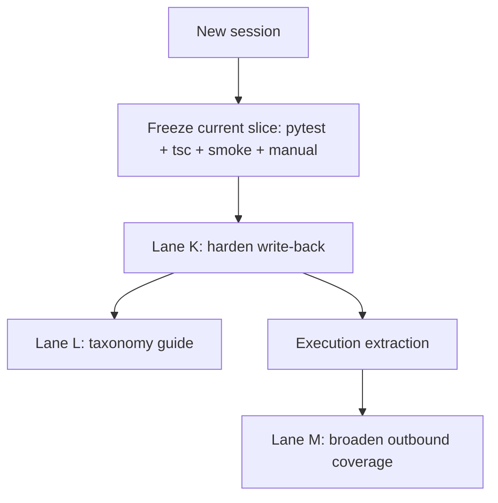

# Next Session Handoff

**Last updated:** 2026-05-19 (K3 verification guardrails)  
**Purpose:** Single entry point for a new agent session. Read this first, then the linked docs.

---

## Session handoff close-out procedure

Before ending a session that changes project state:

1. Update timestamps on every planning doc you touched.
2. Update `parallel_lanes_tracker.md` lane state and append a timestamped session-log row.
3. Update `build_roadmap_assessment.md` if the bottleneck, recommended order, or proof status changed.
4. Update this handoff so the top of the file reflects only active or next-up work.
5. Search for references to the completed lane/task in planning docs and then:
   - remove stale “next step” references
   - move useful completion details into archive/completed sections
   - rewrite any leftover “owned by lane X” language into current, role-based guidance if needed
6. Re-read the opening sections of this file, `parallel_lanes_tracker.md`, and `build_roadmap_assessment.md` to confirm completed work has been downshifted or removed where appropriate.

Rule of thumb:

- if a completed item is still visible near the top of a planning doc, it should be there only because it explains the current state, not because it still reads like active work.

---

**Slice lock:** `complete` — post-slice work is allowed; avoid drive-by edits to slice-owned files unless tasked.

---

## Doc map (read order)

| Order | File | Use when |
|---|---|---|
| 1 | **This file** | Picking up work in a new chat |
| 2 | [parallel_lanes_tracker.md](./parallel_lanes_tracker.md) | Claiming a lane; session log |
| 3 | [local_dev_runbook.md](./local_dev_runbook.md) | Running API + Next locally |
| 4 | [build_roadmap_assessment.md](./build_roadmap_assessment.md) | Why / sequencing / MVP gaps |
| 5 | [archive/build_vertical_slice_tasks.md](./archive/build_vertical_slice_tasks.md) | Archived slice history (steps 1–5) |
| 6 | [current_build_plan.md](./current_build_plan.md) | Canonical phases (conflicts win here) |

---

## Constraints for parallel agents

1. **Admin HTTP:** Use `apps/flavoros/src/lib/admin-api.ts` — do **not** add admin-only helpers to `api.ts`.
2. **High-collision shared backend:**  
   `providers.py`, `approvals.py`, `orchestrator.py`, `workflows/provider_first_sync.py`, `schemas.py` (email fields).
3. **High-collision shared client UI:**  
   `command-center/page.tsx`, `onboarding/page.tsx`, `login/page.tsx`, `ApprovalCard.tsx`, `SessionGuard.tsx`, `api.ts` core auth/session.
4. **Interpretation:** these are not “owned by completed lanes” anymore. They are listed because they are still shared-core files where parallel edits need extra care.

Before first commit: update your lane row in [parallel_lanes_tracker.md](./parallel_lanes_tracker.md) to `in_progress`, then `done` when finished.

---

## Ready work (pick one lane per session)

#### K — Lane J hardening

**Paths:** `services/api/app/**`, `services/api/tests/**`  
**Goal:** extract execution from inline demo flow, tighten retries/idempotency/receipts, improve runbook clarity

#### L — Taxonomy guide

**Paths:** `docs/**`  
**Goal:** produce `docs/FLAVOROS_TAXONOMY.md` now that Lane J vocabulary is real

#### M — Calendar write-back follow-on

**Paths:** `services/api/**`, `apps/flavoros/src/app/(client)/calendar/**`, relevant shared hooks/mappers  
**Goal:** broaden outbound proof beyond communications only after J hardening settles

### Parallel follow-ons (safe to split)

#### K1 — Backend execution extraction

**Paths:** `services/api/app/**`, `services/api/tests/**`  
**Goal:** decouple outbound execution from inline first-sync path, preserve current UX

#### K2 — Client/admin outbound polish

**Paths:** `apps/flavoros/src/app/(client)/communications/**`, `apps/flavoros/src/app/admin/**`, related hooks/components  
**Goal:** clearer status/error states, pull-back polish, receipt visibility

#### K3 — Verification / rollout guardrails — **done**

**Paths:** `scripts/**`, `.github/workflows/**`, `docs/planning/**`  
**Shipped:** smoke status asserts + optional defer; runbook “Restart API after outbound migration”; CI includes `test_outbound_actions.py`; post-deploy checklist below

#### L1 — Taxonomy doc + doc index updates

**Paths:** `docs/**`, optional root `AGENTS.md` pointer  
**Goal:** canonical shared language before the repo broadens again

---

## Suggested pick-up plan (next 2–4 weeks)



| Week | Focus | Outcome |
|---|---|---|
| 1 | Verification freeze + Lane K | Stable outbound trust path |
| 1 | Parallel Lane L | Canonical taxonomy guide |
| 2 | Runtime extraction + rollout guardrails | Safer execution + cleaner execution boundaries |
| 3+ | Lane M | Broader outbound coverage beyond communications |

---

## Verification commands

From repo root unless noted.

```bash
# API tests (use venv — system Python 3.9 may fail on typing)
cd services/api && .venv/bin/python -m pytest \
  tests/test_provider_first_sync.py \
  tests/test_approvals_decide.py \
  tests/test_outbound_actions.py \
  -q

# Next.js typecheck
cd apps/flavoros && pnpm exec tsc --noEmit

# API health + outbound smoke (API must be on 127.0.0.1:8001, migrated + seeded)
curl -sf http://127.0.0.1:8001/health
./scripts/smoke-vertical-slice.sh
```

**Local URLs:** Next `http://localhost:3000`, API `http://127.0.0.1:8001` (see runbook).

**Manual E2E:** login → onboarding (if needed) → sync → Command Center → approve → `/admin` live lists → `/settings` profile + providers.

For post-J work, keep the outbound E2E in the loop: approve communication draft → queued outbound action visible → execution/receipt or failure state visible in client + admin.

### Post-deploy outbound checklist (production / Vercel)

Run after promoting the app or API host:

1. **API health** — `curl -sfI` (or `curl -sf`) the production API base URL `/health` (same host as `NEXT_PUBLIC_FLAVOROS_API_URL` in Vercel).
2. **App shell** — open `https://flavoros.vercel.app` (or your production URL); confirm login loads without CORS errors.
3. **Outbound route** — with a client session token, `GET /outbound-actions` returns **200** (not 404). If 404, production API likely needs restart after migration + env deploy.
4. **Communications approve path** — log in as demo or pilot client → Command Center → approve a `send_communication_draft` item → confirm outbound row shows `executed` or `failed` (or `queued` only if defer is intentionally enabled).
5. **Admin visibility** — `/admin` outbound surface lists the same row with matching status.
6. **CI parity** — confirm latest `main` PR ran [api-integration-tests.yml](../.github/workflows/api-integration-tests.yml) including `test_outbound_actions.py`.

Local parity before deploy: [local_dev_runbook.md](./local_dev_runbook.md) → “Restart API after outbound migration” + `./scripts/smoke-vertical-slice.sh`.

---

## Key repo locations (post-slice)

| Area | Path |
|---|---|
| Admin API client | `apps/flavoros/src/lib/admin-api.ts` |
| Admin surfaces config | `apps/flavoros/src/lib/admin-surfaces.ts` |
| Admin UI panel | `apps/flavoros/src/components/admin/AdminSurfacePanel.tsx` |
| Settings hook | `apps/flavoros/src/lib/hooks/useSettingsData.ts` |
| Command Center mappers | `apps/flavoros/src/lib/mappers.ts` |
| Shared channel loader | `apps/flavoros/src/lib/hooks/useChannelData.ts` |
| Sync processor | `services/api/app/workflows/provider_first_sync.py` |
| Fixtures (types only) | `apps/flavoros/src/lib/fixtures.ts` — display arrays unused on client routes |
| Production app | `https://flavoros.vercel.app` |

---

## New Session Agent Prompt

Copy this into a new implementation session:

```text
Read docs/planning/next_session_handoff.md first, then docs/planning/build_roadmap_assessment.md and docs/planning/parallel_lanes_tracker.md.

Current reality:
- Vertical slice is complete.
- Post-slice lanes A through J are complete.
- The MVP demo proof loop is complete for a communications-first path.

Your assignment:
Choose one follow-on lane and stay inside it:
1. Lane K — harden communications write-back
2. Lane L — build docs/FLAVOROS_TAXONOMY.md
3. Lane M — plan/implement the next outbound breadth slice only if K is calm

Success target:
- preserve the current outbound proof path
- do not regress pytest/tsc/smoke/manual E2E
- keep vocabulary and status language aligned across client, admin, and docs

Scope guardrails:
- do not destabilize the current communications-first flow
- do not broaden multiple outbound lanes at once
- do not rewrite the orchestrator casually
- keep the diff aligned with existing api/mappers/hooks patterns

Before editing:
- confirm lane ownership in docs/planning/parallel_lanes_tracker.md
- preserve existing user changes
- verify with pytest, tsc --noEmit, scripts/smoke-vertical-slice.sh, and the outbound manual E2E

If splitting work:
- execution extraction / backend hardening
- client/admin outbound polish
- taxonomy guide + docs index wiring
- verification/rollout guardrails
```

---

## Session log template

When you finish a lane, append to [parallel_lanes_tracker.md](./parallel_lanes_tracker.md) **Session log**:

```markdown
| YYYY-MM-DD HH:MM TZ | Your label | Lane X | One-line what shipped / verified |
```

Update the lane row **Status** and trim session log to last 5 entries if needed.

---

## Completed work archive

### Demo vertical slice (steps 1–5)

Documented in [archive/build_vertical_slice_tasks.md](./archive/build_vertical_slice_tasks.md). One demo tenant can:

1. Log in (`demo` / `client@demo.local` / `devclient`)
2. Complete onboarding + first provider sync
3. See real artifacts and pending approvals on Command Center
4. Approve or reject with audit trail

**Key implementation:** inline `process_provider_first_sync` after sync commit; stub orchestrator unchanged.

### Post-slice completed lanes

| Lane | Status | Deliverable |
|---|---|---|
| **A** — Backend step 4 | Done | Inline processor in `services/api/app/workflows/provider_first_sync.py` |
| **B** — API tests | Done | `test_provider_first_sync.py`, `test_approvals_decide.py` (22 tests) |
| **C** — Admin console | Done | Live `/admin` via `admin-api.ts`, `admin-surfaces.ts`, `AdminSurfacePanel`, `useAdminOverview` |
| **D** — Env + smoke | Done | `scripts/smoke-vertical-slice.sh` |
| **E** — CI (additive) | Done | `.github/workflows/api-integration-tests.yml` |
| **F** — Settings | Done | `useSettingsData` → `getProfile` + `listProviderConnections` |
| **G** — Docs | Done | [local_dev_runbook.md](./local_dev_runbook.md), tracker updates |
| **H** — GBrain | Done | subsystem landing zone + integration doc |
| **I** — Channel surfaces | Done | `useChannelData`, I1–I6 surfaces + CC widgets on API data |
| **J** — Write-back | Done | communications-first outbound actions, client/admin visibility, smoke + CI coverage |

### Completed lane notes

#### Lane J — Write-back

**Status:** `done`  
**Delivered:** communications-first write-back slice for MVP step 7.

**Shipped:**

- `outbound_actions` table + model
- `communications_outbound.py` enqueue/execution path
- approval decide response with optional outbound action
- queued/executed/failed/pulled_back states in client + admin
- pull-back route for queued actions
- smoke + CI coverage for outbound actions

**Known local caveat:**

- If your API process predates this branch, `/outbound-actions` may 404 until restart + migrations + seed refresh.

#### Lane I — Channel surfaces

**Status:** `done`  
**Delivered:** `useChannelData.ts` + per-surface `*-config.ts` / `use*Data` hooks; communications, calendar, projects, reports, travel, meetings (+ topic detail), briefings, and Command Center goals/calendar widgets wired to live artifacts/approvals. Honest empty states; no fixture display rows on those pages.

**Pattern for future surfaces:** `useChannelData` → surface config → `buildPileDefs` / mapper helpers (see `briefings-config.ts`, `useBriefingsData.ts`).
