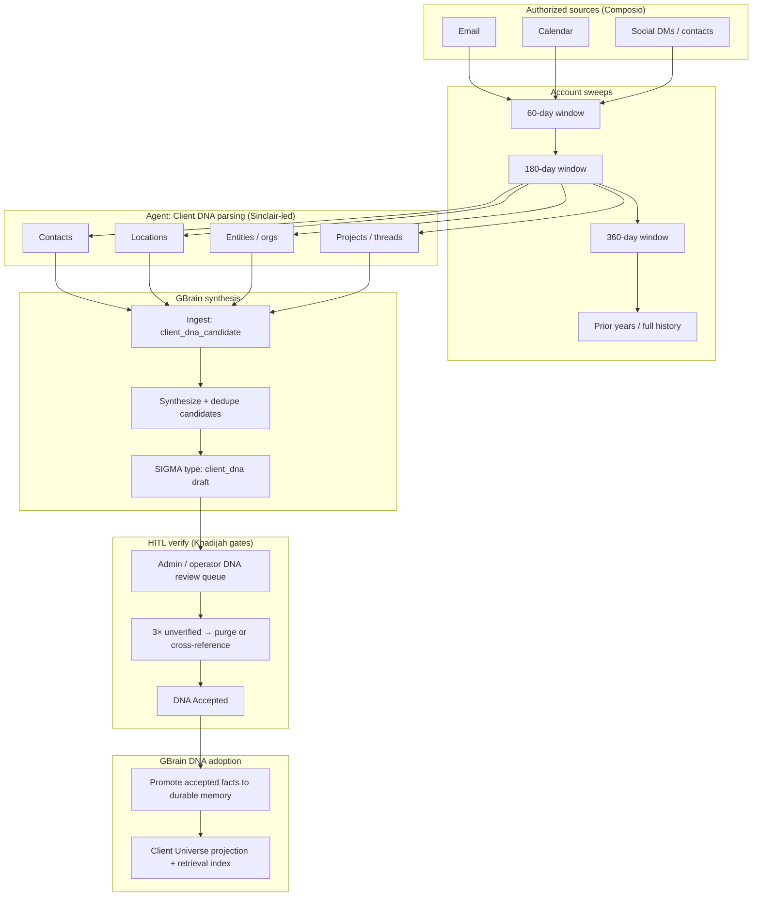

# Client DNA Adoption Model

**Last updated:** 2026-05-22  
**Status:** Canonical workflow specification (diagram → implementation map).  
**Related:** [`client_universe_categories.md`](../architecture/client_universe_categories.md), [`composio_integration.md`](../architecture/composio_integration.md), [`gbrain_integration.md`](../architecture/gbrain_integration.md), [`sigma_model.md`](../architecture/sigma_model.md), [`client_onboarding_model.md`](./client_onboarding_model.md).

## Purpose

This document maps the **Client DNA Adoption Flow** diagram to concrete FlavorOS primitives: `workflow_type`, owning agent, storage layer, and upstream/downstream dependencies.

It is distinct from **client onboarding** ([`client_onboarding_model.md`](./client_onboarding_model.md)), which establishes a governed Client Universe and provider connections. DNA adoption is **post-MVP enrichment**: after onboarding reaches a safe operating baseline, the system sweeps historical provider data, parses four relationship domains, synthesizes memory in GBrain, verifies with HITL, and only then promotes accepted DNA into durable client state.

## Product sequencing rule (non-negotiable)

```text
Onboarding wizard completes (profile, contexts, OAuth, readiness gates)
        ↓
Client reaches Command Center with ready_for_auth / first-sync path
        ↓
[Optional] Lane T: client_onboarding skill expands orchestration (summary + fan-out seeds)
        ↓
DNA adoption explicitly launched (account_sweep → parse → synthesize → HITL → adopt)
```

- **Onboarding does not block on historical sweeps.** The 4-step app wizard and `POST /onboarding/save` remain the gate to Command Center.
- **Historical sweeps start only after** onboarding readiness is recorded (e.g. `readiness.onboarding` + at least one connected provider per product policy).
- **Lane T (TODO-2b)** remains **orchestration-only** for `client_onboarding`: universe creation via API/save path + seed workflow fan-out. It does **not** subsume account sweeps or four-domain parsing; those are TODO-7–10 / lanes W–Z.

## End-to-end flow (diagram)



## Diagram box reference

| Diagram box | `workflow_type` (proposed) | Owner agent | Primary storage | Secondary / index |
|---|---|---|---|---|
| Email / Calendar / Social | *(provider access only)* | — | `provider_connections`, Composio grants | — |
| Account sweep 60d | `account_sweep` | Sinclair (ingest), Khadijah (orchestration) | `sync_checkpoints`, `provider_events`, `normalized_items` | GBrain ingest `provider_raw_ref` (optional) |
| Account sweep 180d | `account_sweep` | Sinclair | same | same |
| Account sweep 360d | `account_sweep` | Sinclair | same | same |
| Prior years | `account_sweep` (`window=prior_years`) | Sinclair | same | same |
| Parse — Contacts | `client_dna_parse` (`domain=contacts`) | Sinclair | Postgres: `client_dna_candidates` (proposed) | GBrain `client_dna_candidate` |
| Parse — Locations | `client_dna_parse` (`domain=locations`) | Sinclair | same | same |
| Parse — Entities | `client_dna_parse` (`domain=entities`) | Sinclair | same | same |
| Parse — Projects | `client_dna_parse` (`domain=projects`) | Sinclair | same | same |
| GBrain synthesis | `client_dna_synthesize` | Sinclair + GBrain subsystem | GBrain index + `sigma_records` (DB when promoted) | Retrieval filters by `client_id` |
| SIGMA / Client DNA artifact | `store_sigma` via adapter | Sinclair | GBrain `sigma_type=client_dna` | Client Artifact projection (summary only) |
| HITL verify | `client_dna_hitl_review` | Khadijah | `approval_requests`, `agent_reports` | Admin queue UI |
| 3× unverified purge | `client_dna_purge` (batch) | Khadijah / system | marks candidates `purged` / `merged` | audit_events |
| DNA Accepted | `client_dna_accept` (terminal state) | Khadijah | `client_dna_candidates.status=accepted` | KV `readiness.dna_adoption` |
| GBrain DNA adoption | `client_dna_adoption` | Khadijah | GBrain durable memory + Client Universe KV | `ingest(category=client_dna_adopted)` |

## Storage layer decision (Lane W canon)

Until verified by HITL, treat parsed facts as **candidates** in both layers:

| Layer | Role | Rationale |
|---|---|---|
| **Postgres (relational)** | Source of truth for workflow runs, checkpoints, candidate rows, HITL decisions, provenance | Queryable, tenant-scoped, auditable; matches existing API patterns |
| **GBrain (index)** | Semantic retrieval, dedupe, synthesis, SIGMA drafts | [`gbrain_integration.md`](../architecture/gbrain_integration.md): GBrain ingests and indexes; Client Universe holds normalized operational slices |

**Rule:** Do not write unverified DNA directly into canonical Client Universe relationship memory. Use `client_dna_candidate` ingest category and relational candidate tables; promote on `client_dna_adoption` only after `DNA Accepted`.

**Production note:** Default adapter is stub (`GBRAIN_ADAPTER=stub` in config). DNA lanes Y/Z require `GBRAIN_ADAPTER=cli` (or future service adapter) in deployed environments before adoption is real.

## Agent ownership

| Phase | Lead | Support |
|---|---|---|
| Provider fetch during sweep | Sinclair | Composio adapters in `routers/providers.py` |
| Four-domain extraction | Sinclair | LLM skills in `services/api/app/skills/` |
| Synthesis & SIGMA draft | Sinclair | `adapters/gbrain.py` |
| HITL policy & approval gates | Khadijah | `approvals.py`, admin surfaces |
| Adoption promotion | Khadijah | `client_dna_adoption` workflow |
| Travel/relationship briefings using adopted DNA | Regine | reads retrieval post-adoption (no ownership of sweep/parse) |

## Dependencies on existing substrate (done / partial)

| Capability | Status | DNA flow usage |
|---|---|---|
| Client Universe envelope + contexts | Done | Target projection after adoption |
| Provider sync + `SyncCheckpoint` | Partial (Phase 5) | Extended by `account_sweep` windows |
| In-process orchestrator | Done | Launches sweep / parse / adoption workflows |
| Approvals / HITL for actions | Done | Reused for DNA verify (new approval kinds) |
| `communication_sweep` | Partial | Distinct from `account_sweep`; comms sweep is incremental inbox; DNA sweep is historical backfill |

## GBrain ingest categories (proposed)

| Category | When written | Purged if |
|---|---|---|
| `client_dna_candidate` | After parse + synthesize | Failed HITL 3× or explicit purge |
| `client_dna_adopted` | After `client_dna_adoption` | Manual admin archive only |

SIGMA mirror: `sigma_type=client_dna`, status `draft` until acceptance, then `active` or superseded per [`sigma_model.md`](../architecture/sigma_model.md).

## Readiness gates

Extend Client Universe KV ([`client_universe_categories.md`](../architecture/client_universe_categories.md)):

| Key | Category | Values |
|---|---|---|
| `dna_adoption` | `readiness` | `not_started`, `sweeping`, `parsing`, `awaiting_hitl`, `accepted`, `adopted` |

Onboarding completion does **not** require `readiness.dna_adoption=adopted`. It may remain `not_started` until operator or client opts into historical enrichment.

## Collision with parallel lanes R / S / T / V

| Lane | Collision risk | Resolution |
|---|---|---|
| **R, S** | None | Docs/CI only |
| **T** | Scope | T owns `client_onboarding` skill orchestration only; DNA sweeps are post-onboarding (this doc) |
| **V** | `providers.py`, `provider_first_sync.py` | **X** owns new `account_sweep` code paths; **V** owns per-message dedup + async first-sync only. Coordinate if both touch `sync_provider` in same session |

## References

- Build plan: [`../planning/client_dna_adoption_build_plan.md`](../planning/client_dna_adoption_build_plan.md)
- Parallel lanes: [`../planning/parallel_lanes_tracker.md`](../planning/parallel_lanes_tracker.md) (W–Z)
- Catalog row: [`planned_feature_catalog.md`](./planned_feature_catalog.md) — Client DNA Adoption Flow
